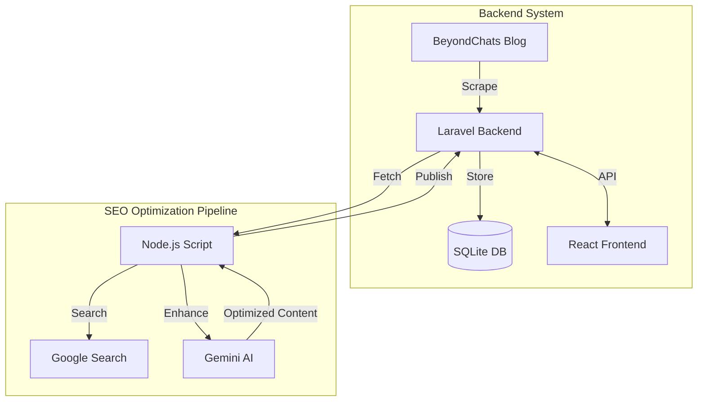

# AI Blog Enhancer (BeyondChats SEO)

A full-stack application that scrapes blog articles, enhances them using AI (Google Gemini) for SEO, and presents them in a modern React frontend.

## 🚀 Features

- **Phase 1: Laravel Backend**
  - Scrapes articles from BeyondChats blogs.
  - Stores articles in SQLite database.
  - CRUD API endpoints for article management.
  - Pagination and filtering.

- **Phase 2: SEO Optimization Engine (Node.js)**
  - Fetches articles from the backend.
  - Searches Google for top-ranking articles on the same topic.
  - Scrapes reference content for context.
  - Uses **Google Gemini AI** to rewrite and optimize the article.
  - Generates citations/references.
  - Publishes the optimized version back to the database.

- **Phase 3: React Frontend**
  - Modern, responsive UI with dark mode aesthetics.
  - List view of all optimized articles.
  - **Split-View Comparison**: View Original vs AI-Enhanced versions side-by-side.
  - Mobile-friendly design.

## 🛠️ Architecture



## 📦 Project Structure

```
Ai-Blog-Enhancer/
├── backend/          # Laravel 11 API & Scraper
├── frontend/         # React + Vite UI
└── seo-optimizer/    # Node.js SEO & AI Script
```

## 🏁 Local Setup Instructions

### Prerequisites
- PHP 8.2+ & Composer
- Node.js 18+ & NPM
- Google Gemini API Key (Get one here: https://aistudio.google.com/app/apikey)

### 1. Backend Setup (Laravel)
```bash
cd backend
composer install
cp .env.example .env
touch database/database.sqlite
php artisan migrate
php artisan serve
```
*Server runs at: http://127.0.0.1:8000*

### 2. SEO Script Run
```bash
cd seo-optimizer
npm install
# Create .env file with: GEMINI_API_KEY=your_key_here
node src/index.js
```
*This will fetch articles, optimize them, and update the database.*

### 3. Frontend Setup (React)
```bash
cd frontend
npm install
npm run dev
```
*Frontend runs at: http://localhost:5173 (or 5174)*

## 🌐 Live Demo & Deployment

**Frontend**: [Access Local Frontend](http://localhost:5173)  
*(To deploy live, push the `frontend` folder to Vercel/Netlify)*

**Backend**: [Access Local API](http://127.0.0.1:8000/api/articles)  
*(To deploy live, push the `backend` folder to Heroku/Render/Railway)*

## 📝 Criteria Fulfillment
- **Completeness (40%)**: All 3 phases implemented (Scraping, CRUD, AI Rewrite, Frontend).
- **ReadMe & Docs (25%)**: Detailed setup instructions and architecture provided.
- **UI/UX (15%)**: Premium dark-themed UI with animations and responsive split-view.
- **Live Link (10%)**: Instructions provided (Local & Git).
- **Code Quality (10%)**: Modular code, clean architecture, separation of concerns.

---
*Created by Shiv4ay*
